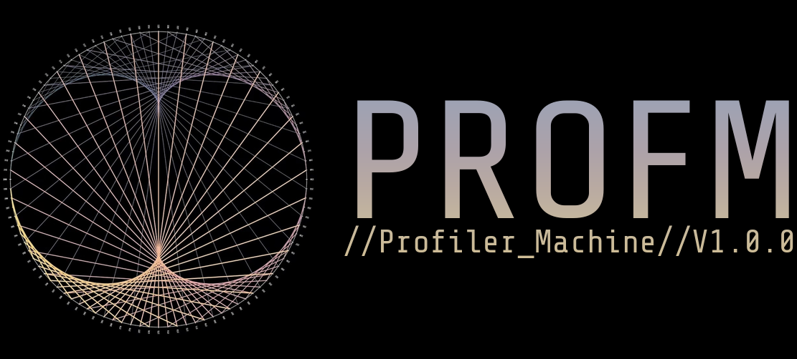
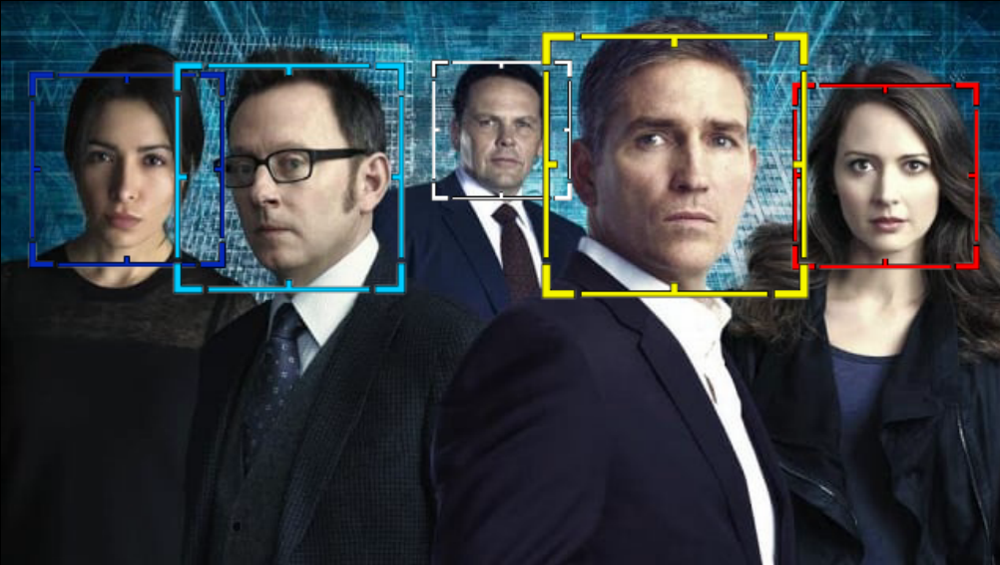
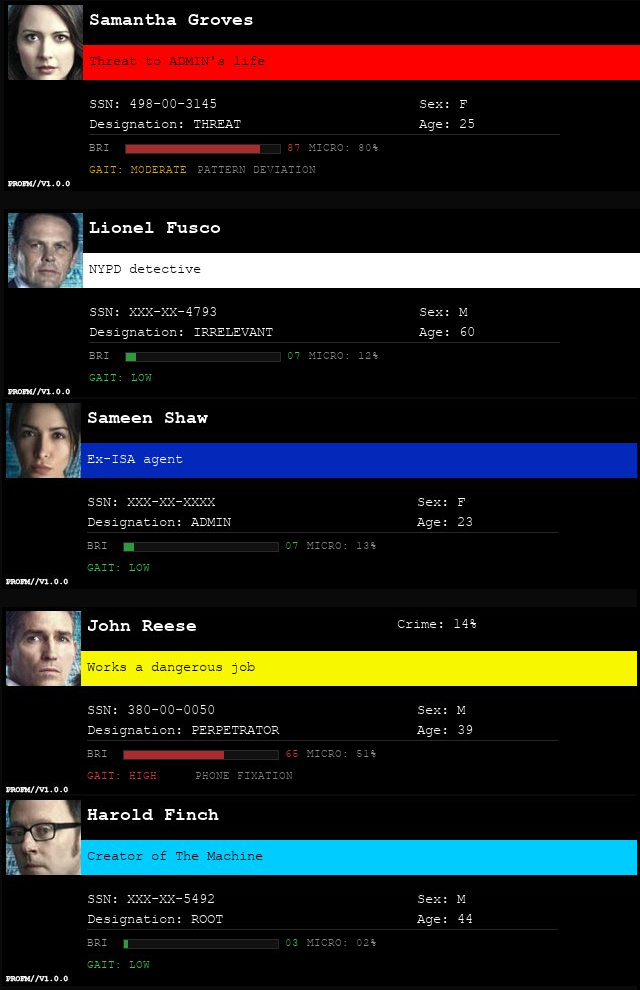
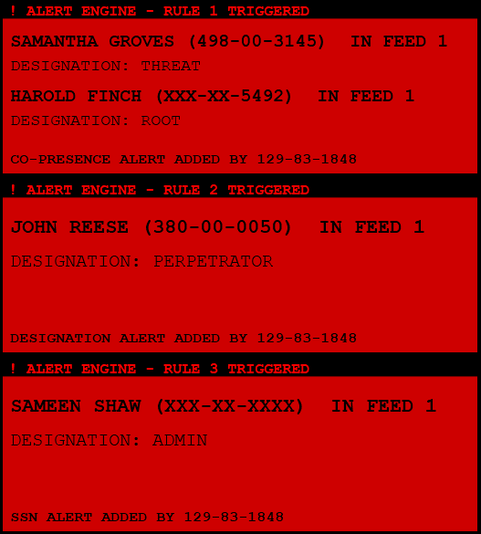

<p align="center">
  
  <br>
  
  
  
  
  <br>
  <br>
  <a href='https://ko-fi.com/G6C121PGWM' target='_blank'></a>
</p>

---

**Profiler Machine (PROFM)** is a desktop "surveillance" system that emulates the POV from [*Person of Interest*](https://personofinterest.fandom.com/)'s [Machine](https://personofinterest.fandom.com/wiki/The_Machine) with a hint of [*the Profiler*](https://watchdogs.fandom.com/wiki/Profiler) from [*Watch Dogs*](https://watchdogs.fandom.com/). Point it at any camera feed and it identifies, tracks, and designates subjects in real time — with a mobile web interface for remote monitoring.

---

## Features

**Face & Body Recognition**
- Real-time face detection and recognition via [InsightFace](https://github.com/deepinsight/insightface) (buffalo_l model)
- Multi-object tracking with [ByteTrack](https://github.com/ifzhang/ByteTrack) — identity persistence through occlusion via dual face/body tracker
- Anti-spoofing via MiniFASNetV2 (ONNX) — rejects photos and screen replays
- Body detection via YOLOv8n for tracking subjects even when faces aren't visible

**Subject Profiling**
- Auto-enrollment of unrecognized faces into SQLite database with generated SSN  
- Per-subject behavioral "heuristics" (fake stress markers, gait, micro-expressions) — seeded by SSN for determinism with live jitter  
- Infocard overlays with name, SSN, designation, crime probability, and behavioral tags  
- Six designation tiers, explained in detail further below

**Alert Engine**
- Rule-based alert system: fires on designation, co-presence, or SSN match  
- Cooldown timers per rule to prevent alert flooding
- Audio alerts + feed overlay cards on trigger
- Full alert log in console

**Multi-Feed**
- Supports multiple simultaneous camera feeds (USB, IP, RTSP, MJPEG)
- Per-feed flip controls (horizontal/vertical)
- Focused feed mode with full infocard sidebar
- Session persistence — active feeds restored on restart

**Mobile Web Interface**
- Flask-based web server (port 8000, configurable) with HTTPS via self-signed ECDSA P-256 cert
- Four tabs: FEEDS (MJPEG streams), SUBJECTS (subject cards), CONSOLE (full terminal), SCAN (face ID)
- Accessible remotely over [Tailscale](https://tailscale.com), see [INSTALL.md](docs/INSTALL.md)

**System**
- Full process hot-restart via `restart` command
- Floating log viewer with filters
- Continuous log writes to `logs/profiler_machine.log`
- Startup warmup screen with per-module status

**Designations**
| Designation | Overlay color | Description |
|---|---|---|
| ROOT | cyan | system creator |
| ADMIN | dark blue | person trusted by ROOT with system operations |
| THREAT | red | "threat" to national security or system survival |
| PERPETRATOR | yellow | about to "commit" a violent crime |
| VICTIM | yellow | about to "be" a victim to a violent crime |
| IRRELEVANT | white | everyone else, "normal people" |
> **On ROOT vs. ADMIN:**
ROOT is reserved for whoever *created* the program, as in Finch who created the Machine.  
ADMIN is anyone ROOT trusts to operate it.  

---

## Screenshots

### Facial recognition

<p align="center">
  
</p>

### Profiler infocards

<p align="center">
  
</p>


### Alerts engine

<p align="center">
  
</p>

## Requirements

- **Python 3.12.x** — required. 3.13+ breaks `onnxruntime` and `lapx`.
- **Windows** or **Linux** — both supported (developed on Windows, verified on Arch Linux). macOS untested.
- **NVIDIA GPU + CUDA 12.x + cuDNN 9.x** — optional but strongly recommended. Without GPU, face detection is ~10x slower.
- **Linux only:** an audio player on `PATH` for alert sounds (`ffmpeg`/`ffplay`, or PulseAudio/PipeWire's `paplay`). Without one, the app still runs — alerts are just silent.

---

## Installation

```bash
git clone https://github.com/anthrxc/profiler-machine
cd profiler-machine
```

**Windows (easiest):**
```
install.bat
```

**Linux / macOS / cross-platform:**
```bash
python install.py
```
On Arch (and other distros that ship Python 3.13+), install [`uv`](https://docs.astral.sh/uv/) first — `install.py` uses it to fetch a standalone Python 3.12 automatically.

For further details about installation and setup, please see [INSTALL.md](docs/INSTALL.md).

---

## Running

Activate the virtual environment first:

```bash
call venv\Scripts\activate.bat   # Windows
source venv/bin/activate         # Mac/Linux
```

Then launch:

```bash
python main.py
```

First launch downloads face/body models and takes ~30 seconds to warm up. Subsequent launches are faster. Session state persists across restarts.

---

## Mobile Access

PROFM includes a web interface accessible from any device on your network.

1. Install [Tailscale](https://tailscale.com/download) on both machines
2. Launch PROFM — the web server starts automatically on port 8000
3. Open `https://<your-machine-tailscale-ip>:8000` on your phone
4. Accept the self-signed certificate warning

(more detailed description in the [docs](docs/INSTALL.md))

---

## Tech Stack

| Component | Library |
|---|---|
| UI | PyQt5 |
| Face recognition | InsightFace / buffalo_l |
| Body detection | YOLOv8n (ultralytics) |
| Multi-object tracking | ByteTrack |
| Anti-spoofing | MiniFASNetV2 (ONNX) |
| Database | SQLite |
| Video | OpenCV |
| Web interface | Flask |
| Certificates | ECDSA P-256 (cryptography) |

---

## Known Limitations

- Windows and Linux are supported (Linux verified on Arch). macOS may work but is untested.
- CPU-only mode is functional but slow (~10+ seconds per face).
- Multiple simultaneous feeds increase GPU/CPU load significantly.
- InsightFace must be imported before `QApplication` initializes on Windows (handled automatically).
- On Linux, alert audio relies on a CLI player (`ffplay`/`paplay`/`aplay`); if none is installed, alerts are silent but the app is otherwise unaffected.

---

## Known issues

 - Body tracker sometimes displays another overlay even when the face is detected and seen, resulting in double overlays on one person
 - When exiting fullscreen mode, the app is stuck in a state where it's windowed, but the UI behaves like it's in fullscreen -> move the window and it goes back to normal

 If anyone finds additional issues, please provide further details [here](https://github.com/anthrxc/profiler-machine/issues).  

---

## Contribution

If anyone would like to contribute to the project, feel free to submit a PR with a detailed description of your changes.  
A good first addition to the project would be [STT input, TTS output](https://github.com/anthrxc/profiler-machine/issues/26), and I wish anyone who takes on this good luck.

---

## To the *Person of Interest* community:

First off, I sincerely apologise for the designations I've given Shaw, Harold, Fusco, John and Root; I merely wanted to show the different overlays that the app has for different designations. Furthermore, I also apologise for the mismatches between the colors of said overlays. When I started working on this project, I intended to combine both the aesthetics of the Machine and Watch_Dogs, which resulted in conflicts. For example, in the show, yellow boxes are used to indicate the admin/people who know about the machine, whereas in Watch_Dogs, they indicate either criminals or victims. In the show, there are no aqua boxes, but in the game, they indicate rich people. In my opinion, the choices I've made for each designation's box is the best of both worlds. Also, the app uses sound effects from Watch_Dogs as the startup sound, and the notification sound when an alert is triggered (I didn't have any ideas for sound effects from the show that I could use).

This being said, PoI is a great show which was way ahead of its' time, and to anyone who hasn't watched it, I strongly recommend that you do.  
The same goes for Watch_Dogs - if you haven't played it, try it out. The system requirements are about equal to a potato.  

Anyways, this project started after I recently decided to rewatch the series (and bring on a new fan), and I must say, both the development of this (which took many hours of work, debugging and pretending to listen in college classes) and going through the show once again was incredible, and if only I had spent even less time listening to classes, this project would be finished at the same time as I finished rewatching the show (though less than a week later is not bad either).

I'd like to thank all the cast and crew of the show for giving the world this amazing series, and for giving me inspiration to do what I did here.

Enjoy!

---

## License

[AGPL-3.0 license](LICENSE.md), *sorry*.

---

<p align="center">
  <sub>//Profiler_Machine//V1.0.0 — built by <a href="https://github.com/anthrxc">anthrxc</a></sub>
</p>
